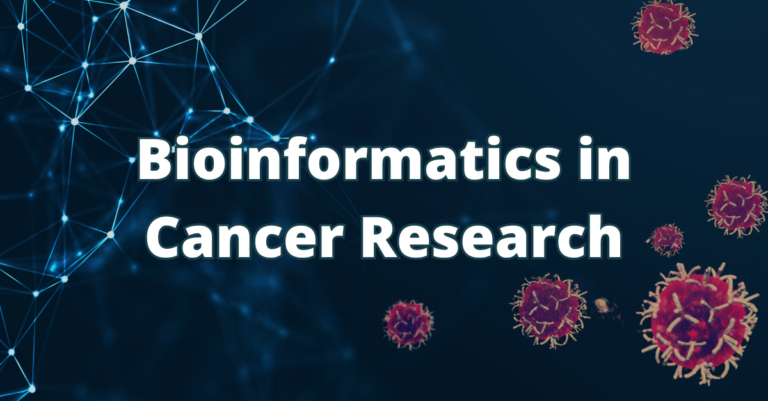

# Hackbio internship:
Welcome to my GitHub repository for the HackBio Internship! This repository highlights my journey through an intensive 8-week practical internship in oncology, focusing on machine learning and data science applications.
## Internship Overview:

The internship was divided into five progressive stages, covering a comprehensive range of activities aimed at building both theoretical and practical foundations in cancer research:
<ul><li> Stage 0:  Built theoretical foundations and wrote an essay on supervised learning's importance in cancer research. </li>
<li>Stage 1: Collaborated with a team to conduct a literature review, "Machine Learning for Lung Cancer Diagnosis, Treatment, and Prognosis," and summarized our findings in a video. </li>
<li>Stage 2: Preprocessed Glioblastoma dataset from TCGA, performed differential expression analysis and pathway enrichment using ShinyGo, alongside Biomarker and ML interns.</li>
<li>Stage 3: Implemented a pipeline for potential Sarcoma biomarkers based on age classification using differential expression, functional enrichment, and ML models.</li>
<li>Stage 4: Reproduced research by clustering gene expression data for LGG glioma based on IDH status, using KNN. </li>
<li>Stage 5-7: Final Capstone Project</li></ul>

## Objectives
Throughout this internship, I achieved:

<ul><li>A deep understanding of supervised and unsupervised machine learning approaches.</li>
<li>Hands-on experience in cancer biomarker discovery.</li>
<li>Practical skills in R programming, data visualization, and dataset analysis.</li>
<li>Collaboration with interdisciplinary teams, project management, and effective communication.</li></ul>
  
## Skills Developed :

<ul><li><B>R Programming</B>: Mastered the basics of R, RStudio, and programming syntax.</li>
<li><B>Data Visualization:</B> Created insightful plots for biological datasets.</li>
<li><B>Machine Learning:</B> Applied KNN and Random Forest models for cancer diagnosis and classification.</B></li>
<li><B>Bioinformatics:</B> Conducted differential gene expression and pathway enrichment analyses.</B></li>
<li><B>Teamwork:</B> Collaborated with cross-functional teams of data scientists and biomarker experts.</B></li></ul>

## How to Use This Repository
You can explore various stages of the internship within this repository, including:

<ul><li>R scripts for preprocessing,Ml models used and analysis.</li>
<li>Research reports,plots generated, R packages and tools used and video presentation.</li></ul>

